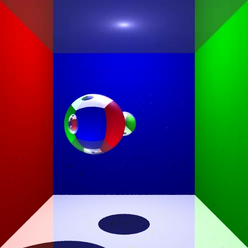
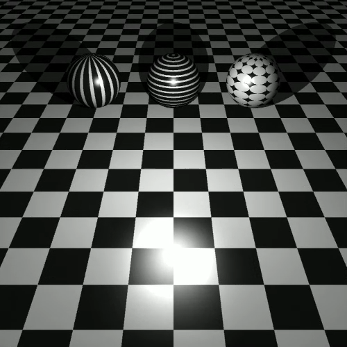
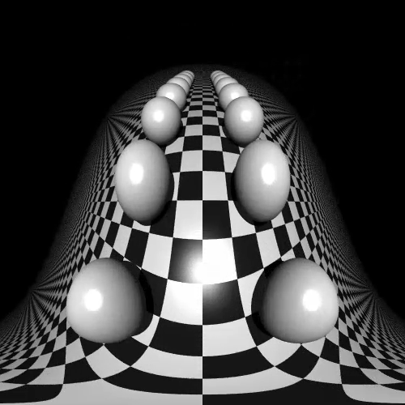

# Ray Tracer

The ray tracer is best used in combination with the [WIF Viewer](https://github.com/fvogels/wif.net).

## Sample Images

### Mesh


```chai
def material(c)
{
  Materials.uniform( [ "ambient": Colors.white() * 0.1,
                       "diffuse": c * 0.8,
                       "specular": Colors.white() * 0.5,
                       "specular_exponent": 10,
                       "reflectivity": 0.0,
                       "transparency": 0,
                       "refractive_index": 0 ] )
}

global m = mesh("G:/repos/ucll/3dcg/raytracer/meshes-v3/meshes/optimized-lucy.bmesh")

def scene_at(now)
{
  var camera = Cameras.perspective( [ "eye": pos(0,0,3),
                                      "look_at": pos(0,0,0) ] )


  var angle = Animations.animate(degrees(0), degrees(360), seconds(5))
  var m2 = rotate_around_x(degrees(-90), center( pos(0, 0, 0), m))
  var m3 = resize_y_uniform(m2, 2)
  var root = rotate_around_y( degrees(180) + angle[now], decorate( material(Colors.white()), m3 ) )

  var lights = [ Lights.omnidirectional( pos(5, 5, 5), Colors.white() ) ]

  create_scene(camera, root, lights)
}

var raytracer   = Raytracers.latest()

var renderer    = Renderers.standard( [ "width": 500,
                                        "height": 500,
                                        "sampler": Samplers.multijittered(2),
                                        "ray_tracer": raytracer ] )

pipeline( scene_animation(scene_at, seconds(5)),
          [ Pipeline.animation(30),
            Pipeline.renderer(renderer),
            Pipeline.studio() ] )
```

### Shadows, Reflection and Refraction



```chai
def scene_at(now)
{
  var camera = Cameras.perspective( [ "eye": pos(0,0,5),
                                      "look_at": pos(0,0,0) ] )

  var floor_material = Materials.uniform( [ "ambient": Colors.white() * 0.1,
                                            "diffuse": Colors.white() * 0.8,
                                            "reflectivity": 0.5 ] )

  var left_wall_material = Materials.uniform( [ "ambient": Colors.red() * 0.1,
                                                "diffuse": Colors.red() * 0.8 ] )

  var right_wall_material = Materials.uniform( [ "ambient": Colors.green() * 0.1,
                                                 "diffuse": Colors.green() * 0.8 ] )

  var back_wall_material = Materials.uniform( [ "ambient": Colors.blue() * 0.1,
                                                "diffuse": Colors.blue() * 0.8 ] )

  var ceiling_material = floor_material

  var sphere_material = Materials.uniform( [ "ambient": Colors.blue() * 0.1,
                                             "diffuse": Colors.blue() * 0.8,
                                             "specular": Colors.white() * 0.8,
                                             "specular_exponent": 10,
                                             "transparency": 0.7,
                                             "refractive_index": 2.5 ] )

  var small_sphere_material = Materials.uniform( [ "ambient": Colors.white() * 0.1,
                                                   "diffuse": Colors.white() * 0.8,
                                                   "reflectivity": 0.8 ] )


  var primitives = []
  primitives.push_back( translate(vec(0,-2,0), decorate(floor_material, xz_plane())) )
  primitives.push_back( translate(vec(0,2,0), decorate(ceiling_material, xz_plane())) )
  primitives.push_back( translate(vec(-2,0,0), decorate(left_wall_material, yz_plane())) )
  primitives.push_back( translate(vec(2,0,0), decorate(right_wall_material, yz_plane())) )
  primitives.push_back( translate(vec(0,0,-2), decorate(back_wall_material, xy_plane())) )


  var sphere_position = Animations.circular( [ "position": pos(0,0,1),
                                               "around": pos(0,0,0),
                                               "duration": seconds(5) ] )
  primitives.push_back( decorate( sphere_material, translate(sphere_position[now] - pos(0,0,0), scale(0.5, 0.5, 0.5, sphere())) ) )
  primitives.push_back( decorate( small_sphere_material, scale(0.25, 0.25, 0.25, sphere()) ) )

  var root = union(primitives)

  var lights = [ Lights.omnidirectional( pos(0,1.9,0), Colors.white() ) ]

  create_scene(camera, root, lights)
}

var raytracer   = Raytracers.v8()
var renderer    = Renderers.standard( [ "width": 500,
                                        "height": 500,
                                        "sampler": Samplers.multijittered(2),
                                        "ray_tracer": raytracer ] )

pipeline( scene_animation(scene_at, seconds(5)),
          [ Pipeline.animation(30),
            Pipeline.renderer(renderer),
            Pipeline.studio() ] )
```

### Materials



```chai
def scene_at(now)
{
  var ez = Animations.ease(Animations.animate(15, 9, seconds(5)), Easing.cubic_out())[now]
  var ey = Animations.ease(Animations.animate(10, 1, seconds(5)), Easing.cubic_out())[now]
  var lz = Animations.ease(Animations.animate(10, 0, seconds(5)), Easing.cubic_out())[now]

  var camera = Cameras.perspective( [ "eye": pos(0,ey,ez),
                                      "look_at": pos(0,0,lz) ] )

  var white = Materials.uniform( [ "ambient": Colors.white() * 0.1,
                                   "diffuse": Colors.white() * 0.8,
                                   "specular": Colors.white(),
                                   "specular_exponent": 20 ] )

  var black = Materials.uniform( [ "ambient": Colors.black(),
                                   "diffuse": Colors.white() * 0.1,
                                   "specular": Colors.white(),
                                   "specular_exponent": 20 ] )

  var checkered_pattern = Patterns.checkered(1, 1)
  var checkered_material = Materials.from_pattern(checkered_pattern, white, black)

  var lines_pattern = Patterns.lines(.02, .04)
  var lines_material = Materials.from_pattern(lines_pattern, white, black)
  var lines_material2 = Materials.from_pattern(Patterns.rotate(degrees(90), lines_pattern), white, black)

  var polka_pattern = Patterns.polka2d(0.05, 0.1)
  var polka_material = Materials.from_pattern(polka_pattern, white, black)

  var angle = Animations.animate(degrees(0), degrees(360), seconds(5))

  var root = union( [ decorate(checkered_material, translate(vec(0, -1, 0), xz_plane())),
                      decorate(lines_material, sphere()),
                      decorate(lines_material2, translate(vec(-3,0,0),sphere())),
                      decorate(polka_material, translate(vec(3,0,0),sphere()))
                      ] )

  var lights = [ Lights.omnidirectional( pos(0,2,5), Colors.white() ) ]

  create_scene(camera, root, lights)
}

var raytracer   = Raytracers.v6()

var renderer    = Renderers.standard( [ "width": 500,
                                       "height": 500,
                                       "sampler": Samplers.multijittered(2),
                                       "ray_tracer": raytracer ] )

pipeline( scene_animation(scene_at, seconds(5)),
          [ Pipeline.animation(30),
            Pipeline.renderer(renderer),
            Pipeline.studio() ] )
```

### Fisheye Camera



```chai
// movie
def scene_at(now)
{
  var y = Animations.ease(Animations.animate(5, 0, seconds(5)), Easing.quintic_out())
  var z = Animations.animate(10, -20, seconds(5))

  var camera = Cameras.fisheye( [ "eye": pos(0, y[now], z[now]),
                                  "look_at": pos(0, 0, z[now] - 1),
                                  "up": vec(0, 1, 0),
                                  "horizontal_angle": degrees(270),
                                  "vertical_angle": degrees(180) ] )

  var white = Materials.uniform( [ "ambient": Colors.white() * 0.1,
                                   "diffuse": Colors.white() * 0.8,
                                   "specular": Colors.white(),
                                   "specular_exponent": 20,
                                   "reflectivity": 0,
                                   "transparency": 0,
                                   "refractive_index": 0 ] )

  var black = Materials.uniform( [ "ambient": Colors.black(),
                                   "diffuse": Colors.white() * 0.1,
                                   "specular": Colors.white(),
                                   "specular_exponent": 20,
                                   "reflectivity": 0,
                                   "transparency": 0,
                                   "refractive_index": 0 ] )

  var pattern = Patterns.checkered(1, 1)
  var checkered = Materials.from_pattern(pattern, black, white)

  var spheres   = []

  for_each([-2..5], bind(fun (i, spheres) {
                     spheres.push_back(translate(vec(-2,0,-i*3), sphere()))
                     spheres.push_back(translate(vec(2,0,-i*3), sphere()))
                   }, _, spheres))

  var spheres_union = decorate(white, union(spheres))

  var plane     = decorate(checkered, translate(vec(0,-1,0), xz_plane()))

  var root      = union( [spheres_union, plane] )

  var lights    = [ Lights.omnidirectional( pos(0, 5, 5), Colors.white() ) ]

  return create_scene(camera, root, lights)
}


var anim = scene_animation(scene_at, seconds(5))

var raytracer   = Raytracers.v6()

var renderer    = Renderers.standard( [ "width": 500,
                                        "height": 500,
                                        "sampler": Samplers.multijittered(3),
                                        "ray_tracer": raytracer ] )


pipeline( anim,
          [ Pipeline.animation(30),
            Pipeline.renderer(renderer),
            Pipeline.studio() ] )
```